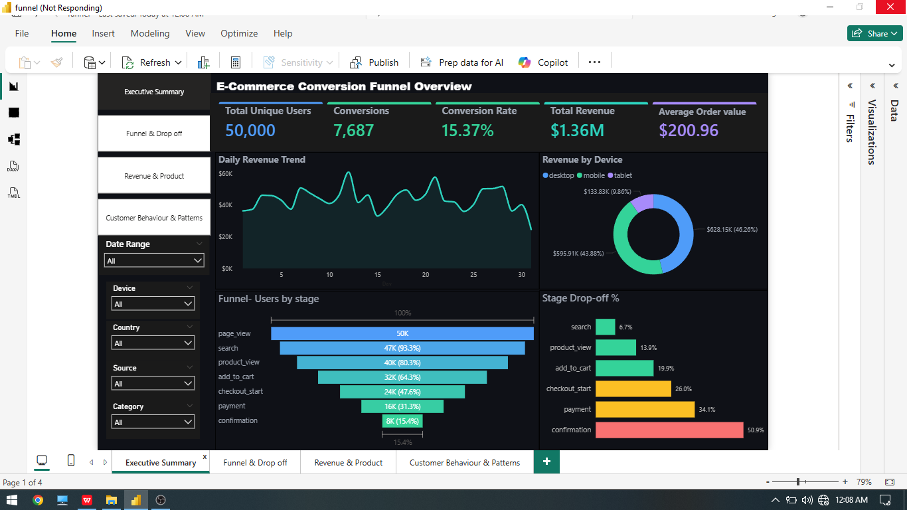
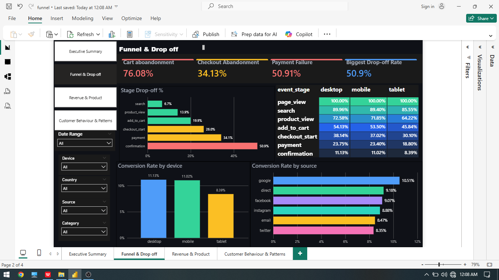
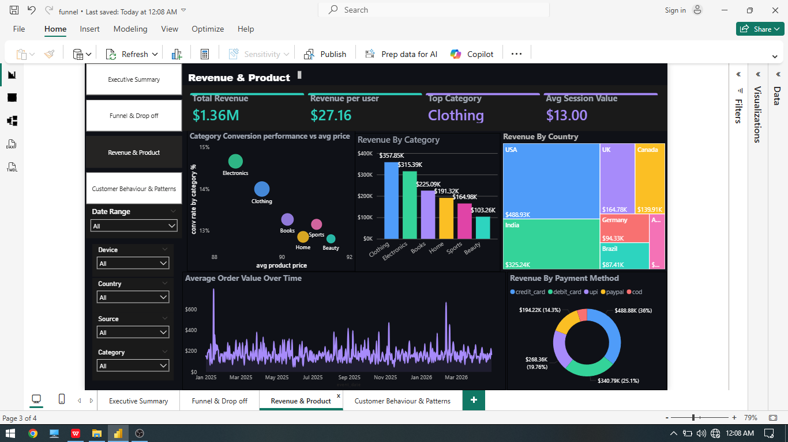
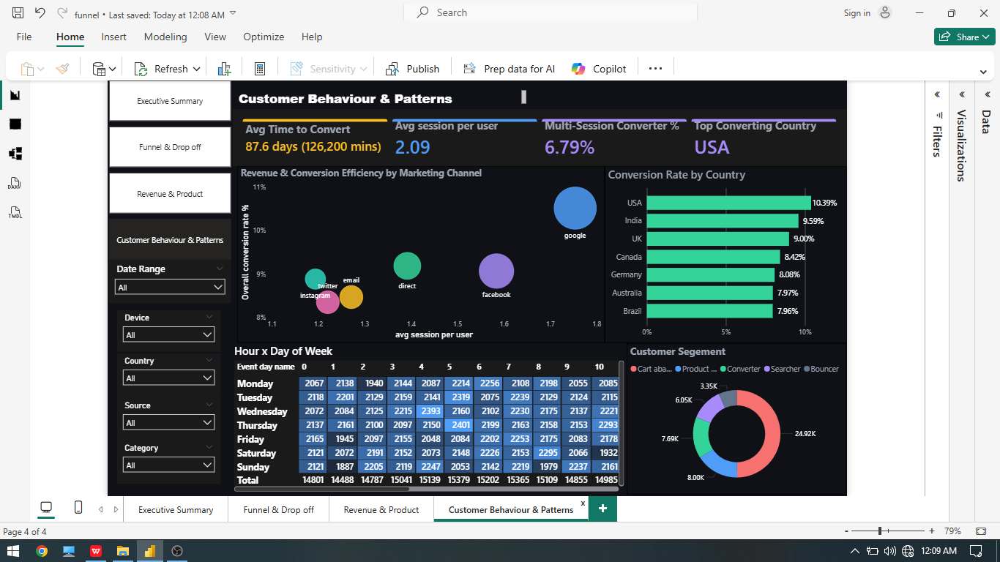

# 🛒 E-Commerce Funnel Analysis
### End-to-End Data Analytics Project | Python · MySQL · Power BI


## 📌 Project Overview

This project is a complete end-to-end data analytics pipeline built on an e-commerce funnel dataset. It tracks 50,000 users across 7 funnel stages — from their first page view all the way through to purchase confirmation — and answers the core business question every e-commerce team asks daily:

> **Where are we losing customers, why, and what should we do about it?**

The project was built in three stages — data cleaning in Python, deep-dive analysis in MySQL, and an interactive dark-mode dashboard in Power BI — each tool chosen deliberately for what it does best.

---

## ⚠️ About the Dataset

> The dataset used in this project is a **replica of a real-world e-commerce funnel dataset**. It was **AI-generated** to mirror the structure, patterns, distributions, and anomalies found in production e-commerce data — including realistic data quality issues such as duplicate records, negative prices, null values at specific funnel stages, and zero-quantity entries. While no real customer data was used, the dataset is intentionally designed to reflect genuine business scenarios and challenges a data analyst would encounter in a real role.

| Property | Detail |
|---|---|
| Raw rows | 367,334 |
| Cleaned rows | 361,598 |
| Unique users | 50,000 |
| Date range | January 2025 — April 2026 |
| Funnel stages | 7 (page_view → search → product_view → add_to_cart → checkout_start → payment → confirmation) |
| Countries | USA, India, UK, Canada, Germany, Australia, Brazil |
| Devices | Desktop, Mobile, Tablet |
| Traffic sources | Google, Facebook, Direct, Email, Twitter, Instagram |
| Product categories | Clothing, Electronics, Books, Home, Sports, Beauty |
| Payment methods | Credit Card, Debit Card, UPI, PayPal, COD |

---

---

## 🔧 Tools & Technologies

| Tool | Version | Purpose |
|---|---|---|
| Python | 3.11 | Data cleaning, EDA, visualizations |
| Pandas | 2.x | Data manipulation and transformation |
| Matplotlib / Seaborn | Latest | Static visualizations |
| Plotly | Latest | Interactive charts in notebook |
| MySQL | 8.0 | Analytical queries and funnel analysis |
| Power BI Desktop | Latest | Interactive 4-page dark mode dashboard |

---

## 🧹 Stage 1 — Data Cleaning (Python)

The raw dataset contained several data quality issues that required careful handling.

### Issues Found & Fixed

| Issue | Raw Count | Fix Applied |
|---|---|---|
| Duplicate rows | 500 | Removed using subset deduplication on user_id, session_id, event_stage, timestamp |
| Negative product prices | 5,179 | Removed — invalid data entries |
| Negative revenue | 7 | Removed — confirmed orders cannot have negative revenue |
| Zero quantity in purchase stages | 50 | Removed only for add_to_cart, checkout_start, payment, confirmation |
| Null product prices (page_view, search) | 196,166 | **Preserved** — these stages naturally have no product price |

### Critical Bug Discovered

The original cleaning script contained a silent data loss bug:

```python
# WRONG — drops all null price rows including valid page_view events
df_clean = df_clean[df_clean['product_price'] >= 0]

# CORRECT — preserves nulls, only removes genuinely negative values
df_clean = df_clean[df_clean['product_price'].isna() | (df_clean['product_price'] >= 0)]
```

In pandas, `NaN >= 0` returns `False` — meaning the original code was silently dropping 196,166 perfectly valid rows (page_view and search events) that naturally have no product price. Fixing this single line retained 195,840 additional rows and changed the cleaned dataset from 165,758 rows to the correct **361,598 rows**.

### Cleaning Order

```
1. Remove duplicates          → -500 rows
2. Remove negative prices     → -5,179 rows
3. Remove negative revenue    → -7 rows
4. Remove zero quantity       → -50 rows (purchase stages only)
─────────────────────────────────────────
Total removed: 5,736 rows
Final dataset: 361,598 rows (98.4% retained)
```

---

## 🗄️ Stage 2 — SQL Analysis (MySQL)

17 queries were written covering every dimension of the funnel.

### Query Categories

| # | Query | Technique Used |
|---|---|---|
| 1 | Basic funnel stage counts | GROUP BY, COUNT DISTINCT |
| 2 | Stage-to-stage conversion rates | CTE, LAG window function |
| 3 | Overall conversion rate | Conditional aggregation |
| 4 | Funnel by device type | CASE WHEN pivot |
| 5 | Funnel by traffic source | GROUP BY, revenue aggregation |
| 6 | Drop-off analysis | CTE, OVER() window |
| 7 | Revenue by product category | Filtered aggregation |
| 8 | Payment method performance | Revenue share calculation |
| 9 | Daily trend analysis | DATE grouping |
| 10 | Hourly activity pattern | HOUR() extraction |
| 11 | Country-wise funnel performance | Multi-metric GROUP BY |
| 12 | Customer segmentation | Nested CTE, CASE WHEN |
| 13 | Avg time to convert | TIMESTAMPDIFF, JOIN |
| 14 | Session-to-conversion rate | Multi-session CTE |
| 15 | Weekly cohort analysis | DATE_SUB, WEEKDAY |
| 16 | Top products by conversion | HAVING clause filter |

---

## 📊 Stage 3 — Power BI Dashboard

A 4-page interactive dark mode dashboard with 5 synced slicers across all pages.

---

### 📄 Page 1 — Executive Summary (E-Commerce Conversion Funnel Overview)

**Goal:** Give stakeholders an instant high-level snapshot of overall business performance.

**KPI Cards (Top Row):**
| KPI | Value |
|---|---|
| Total Unique Users | 50,000 |
| Conversions | 7,687 |
| Conversion Rate | 15.37% |
| Total Revenue | $1.36M |
| Average Order Value | $200.96 |


---

### 📄 Page 2 — Funnel & Drop-off Analysis

**Goal:** Diagnose exactly where and how severely users are leaving the funnel.

**KPI Cards:**
| KPI | Value |
|---|---|
| Cart Abandonment Rate | 76.08% |
| Checkout Abandonment Rate | 34.13% |
| Payment Failure Rate | 50.91% |
| Biggest Drop-off Stage | Confirmation — 50.9%


---

### 📄 Page 3 — Revenue & Product Analysis

**Goal:** Identify what is driving revenue across categories, payment methods, and countries.

**KPI Cards:**
| KPI | Value |
|---|---|
| Total Revenue | $1.36M |
| Revenue per User | $27.16 |
| Top Revenue Category | Clothing — $357,850 |
| Top Payment Method | Credit Card |

**Scatter Plot Insight:** All 6 categories cluster between $88–$92 average price yet conversion varies from 12.81% (Beauty) to 14.66% (Electronics) — proving price is not the primary conversion driver.

---

### 📄 Page 4 — Customer Behaviour & Patterns

**Goal:** Understand who the customers are, when they are active, and which channels perform best.

**KPI Cards:**
| KPI | Value |
|---|---|
| Avg Time to Convert | 87.6 days (126,200 mins) |
| Avg Sessions per User | 2.09 |
| Multi-Session Converter % | 6.79% |
| Top Converting Country | USA |


> **Design decision:** The Marketing Channel scatter plot. It adds three analytical dimensions simultaneously — session depth, conversion efficiency, and revenue contribution per traffic source — making it a stronger and more actionable visual for Page 4.

---

### Slicers (Synced Across All 4 Pages)

| Slicer | Field | Style |
|---|---|---|
| 📅 Date Range | event_date | Dropdown — All / specific range |
| 📱 Device Type | device | Dropdown — All / Desktop / Mobile / Tablet |
| 🌍 Country | country | Dropdown — All / 7 countries |
| 🌐 Traffic Source | source | Dropdown — All / 6 sources |
| 🏷️ Product Category | product_category | Dropdown — All / 6 categories |

All 5 slicers are synced using **View → Sync Slicers** — selecting any filter updates all visuals on all 4 pages simultaneously.

---

---

## 💡 Key Insights

### 1. Overall Funnel Performance
- **50,000 users** entered the funnel at page view
- **7,687 users** completed a purchase — overall conversion rate of **15.37%**
- **$1.36M total revenue** with average order value of **$200.96**

### 2. Payment Stage is the Biggest Problem
```
Payment → Confirmation drop-off: 50.91%
```
Half of all users who reach payment never complete the purchase. This is a payment gateway issue — users are motivated enough to enter payment details but something fails at the final step. Fixing this single stage could recover an estimated **$700K+ annually**.

### 3. Cart Abandonment is Above Industry Average
```
Add to Cart → No Purchase: 76.08%
```
Industry average is approximately 70%. The 6% excess represents a significant recoverable revenue opportunity through abandoned cart email sequences and retargeting.

### 4. Google Dominates All Dimensions
The Marketing Channel scatter plot on Page 4 shows Google's bubble is the largest (highest revenue), furthest right (most sessions per user), and highest (best conversion rate). It outperforms every other channel on all three metrics simultaneously.

### 5. Price Does Not Drive Conversion Differences
All 6 product categories cluster between **$88–$92 average price** yet conversion varies from 12.81% to 14.66%. UX and product presentation — not pricing — are the levers to pull.

### 6. Tablet Users Convert 24% Worse
```
Mobile:  11.02%
Desktop: 11.00%
Tablet:  8.39%
```
The checkout experience is not optimised for tablet screen sizes. A responsive redesign specifically tested on tablets is a low-cost, high-ROI fix.

### 7. Electronics vs Clothing Trade-off
Electronics converts best at 14.66% but Clothing generates the most revenue at $357,850. Clothing buyers spend more per order. Both categories together drive **53% of total conversions**.

### 8. USA and India Lead — India Growing
```
USA:    10.39% conversion rate — $463K revenue
India:  9.59%  conversion rate — $325K revenue
```
India is the second largest market on both metrics and shows strong growth trajectory warranting dedicated campaign investment.

---

## 📐 Key DAX Measures

```dax
-- Overall Conversion Rate
Overall Conversion Rate % =
DIVIDE(
    CALCULATE(DISTINCTCOUNT(funnel_events[user_id]),
        funnel_events[event_stage] = "confirmation"),
    CALCULATE(DISTINCTCOUNT(funnel_events[user_id]),
        funnel_events[event_stage] = "page_view")
) * 100

-- Stage Drop-off Rate (filter context corrected with ALLEXCEPT)
Stage Drop-off Rate % =
VAR cur = MAX(funnel_events[stage_order])
VAR cur_users =
    CALCULATE(DISTINCTCOUNT(funnel_events[user_id]),
        ALLEXCEPT(funnel_events, funnel_events[stage_order]),
        funnel_events[stage_order] = cur)
VAR prev_users =
    CALCULATE(DISTINCTCOUNT(funnel_events[user_id]),
        ALLEXCEPT(funnel_events, funnel_events[stage_order]),
        funnel_events[stage_order] = cur - 1)
RETURN
    IF(cur <= 1 || ISBLANK(prev_users) || prev_users = 0, BLANK(),
    DIVIDE(prev_users - cur_users, prev_users) * 100)

-- Cart Abandonment Rate
Cart Abandonment Rate % =
DIVIDE(
    CALCULATE(DISTINCTCOUNT(funnel_events[user_id]),
        funnel_events[event_stage] = "add_to_cart") -
    CALCULATE(DISTINCTCOUNT(funnel_events[user_id]),
        funnel_events[event_stage] = "confirmation"),
    CALCULATE(DISTINCTCOUNT(funnel_events[user_id]),
        funnel_events[event_stage] = "add_to_cart")
) * 100

-- Avg Sessions per User
Avg Session per User =
DIVIDE(
    DISTINCTCOUNT(funnel_events[session_id]),
    DISTINCTCOUNT(funnel_events[user_id])
)

-- Conv Rate by Category (uses product_view as base — category starts here)
Conv Rate by Category % =
VAR prod_views =
    CALCULATE(DISTINCTCOUNT(funnel_events[user_id]),
        funnel_events[event_stage] = "product_view",
        ALLEXCEPT(funnel_events, funnel_events[product_category]))
VAR confirmed =
    CALCULATE(DISTINCTCOUNT(funnel_events[user_id]),
        funnel_events[event_stage] = "confirmation",
        ALLEXCEPT(funnel_events, funnel_events[product_category]))
RETURN
    IF(ISBLANK(prod_views) || prod_views = 0, BLANK(),
    DIVIDE(confirmed, prod_views) * 100)
```

---

## 🎯 Business Recommendations

**1. Fix the Payment Gateway — Priority: Critical**
50.91% of users drop at payment. Audit payment error logs filtered by device and country using the Power BI dashboard slicers. Identify which combinations have the worst failure rates and investigate those first.

**2. Launch Retargeting Campaigns — Priority: High**
76.08% cart abandonment rate with Google as the highest converting source. An email retargeting sequence for cart abandoners combined with Google remarketing ads targets the highest-intent users at the most cost-effective channel.

**3. Optimise Tablet Checkout UX — Priority: Medium**
Tablet converts 24% worse than other devices. A responsive checkout redesign tested specifically on tablet screen sizes is a low-cost fix with measurable impact on the 9.86% of revenue coming from tablet users.

---

## 📸 Dashboard Preview

### Page 1 — Executive Summary


### Page 2 — Funnel & Drop-off Analysis


### Page 3 — Revenue & Product Analysis


### Page 4 — Customer Behaviour & Patterns



---

## 🤝 Connect

[](https://github.com/ss4639574-eng)

---

## 📄 License

This project is open source and available under the [MIT License](LICENSE).

---

*Built with curiosity, fixed with persistence, and presented with clarity.*
